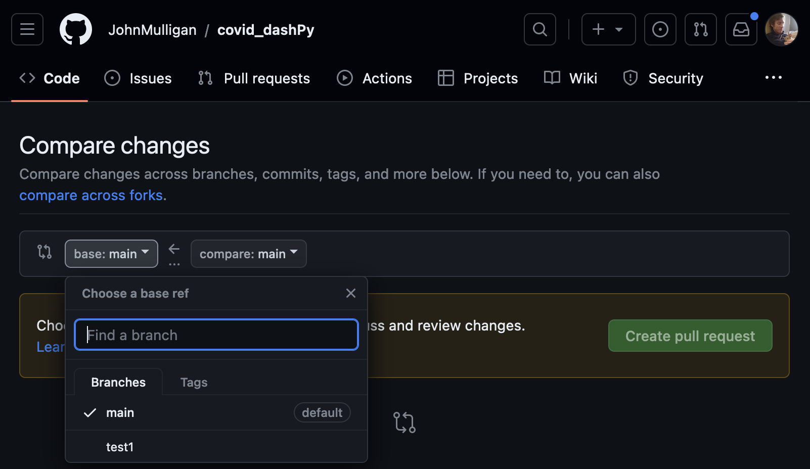

# Adaptation of CDC's All-Cause Excess Mortality Dashboard

This repo uses CDC data on COVID-19-related excess mortality as an exercise in exploratory data analysis, critiquing and designing interactive data visualizations, and deploying these to the web.

csv from: https://data.cdc.gov/api/views/xkkf-xrst/rows.csv?accessType=DOWNLOAD&bom=true&format=true%20target=

## Core technologies

The following frameworks and services are used:

* Free, curated data from the CDC
* Python
* Pandas
* Plotly/Dash (Flask + React)
* Git

This lesson was developed for the Rice Center for Research Computing and the Start@Rice program.

-------------------------

## I. Pre-Class Installations

### A. Install Anaconda / Jupyter Notebooks

Download and install Anaconda.

* Windows: https://docs.anaconda.com/free/anaconda/install/windows/
* Mac: https://docs.anaconda.com/free/anaconda/install/mac-os/

Use all of the defaults for installation except make sure to check the box labeled "Make Anaconda the default Python."

### B. Install Git

Mac:

* Download and run [the installer](https://git-scm.com/downloads)
* Open up a terminal and run ```git clone https://github.com/JohnMulligan/covid_dashPy.git```
	* If prompted, follow the instructions to install command line utilities / xcode
	* If it just works, then you're good to go! Remove that folder with ```rm -rf covid_dashPy```

Windows:

* Download and run [the installer](https://gitforwindows.org/)

### C. Install a basic text editor

* Windows or Mac: Visual studio https://visualstudio.microsoft.com/
* Mac only: Barebones software text editor https://www.barebones.com/products/bbedit/

-------------------------

## II. Sharing Code and Exploring Data

### A. Git and GitHub

Create a GitHub account and log in.

These instructions are from https://swcarpentry.github.io/git-novice/07-github.html#ssh-background-and-setup (thanks, SWC!)

Create a directory for your keys

	cd ~/.ssh

If you get an error, create that directory and then move into it

	mkdir ~/.ssh
	cd ~/.ssh

Create a pair of ssh keys, and name the keys ```githubkeys```. Don't use a passphrase.

	ssh-keygen

This creates 2 keys -- a public and a private key. NEVER share your private key.

Inspect the contents of your public key

	cat githubkeys.pub

And copy the output to your clipboard. Now, going to GitHub.com, click on your profile icon in the top right corner to get the drop-down menu. Click “Settings,” then on the settings page, click “SSH and GPG keys,” on the left side “Account settings” menu. Click the “New SSH key” button on the right side. Now, you can add a title of your choice, paste your SSH key into the field, and click the “Add SSH key” to complete the setup.

Then, navigate to this repository, and click on "Fork" in the upper right to make a copy of it in your own account.

* Original repo: ```https://github.com/JohnMulligan/covid_dashPy```
* Your repo: ```https://github.com/{{YOURUSERNAME}}/covid_dashPy```

In your repository, click on the green "Code" button in the top right, and select the SSH option. Then, copy that URL.

Now, go back to your terminal.

1. Load your keys ```ssh-add githubkeys```
1. Go to your home directory ```cd ~```
1. Create a directory named "code" ```mkdir code```
1. Navigate into it ```cd code```
1. Pull down your fork of the repository ```git clone git@github.com:{{YOURUSERNAME}}/covid_dashPy.git```
1. Navigate into that folder ```cd covid_dashPy```
1. And then take a look around ``` ls -lah .```

You should now see the contents of this repository listed in your terminal.

### B. Exploratory Data Analysis

In Anaconda, launch Jupyter and open the ```excess_mortality_notebooks.ipynb``` notebook. We'll walk through the analysis there.

A very helpful cheatsheet for Pandas is available in this repo's "Documentation" folder.

------------------

Now we have a functioning python environment and we have poked around at this interesting dataset. But we've also seen how this data could be sliced in thousands of different ways to answer interesting questions. In the second half of this course, we'll see how to make that slicing and dicing visually intuitive, to get us to some interesting answers much faster.

_suggested 10 minute break_

------------------

## III. Building and Deploying a data Visualization Application

### A. Setting up your virtual environment

1. In your repository folder, launch a virtual environment ```python -m venv venv```
1. Activate that virtual environment
	1. Windows ```. venv/Scripts/activate```
	1. Mac ```source venv/bin/activate```
1. Install your Python requirements ```pip3 install -r requirements.txt```
1. Test that the app works ```python application.py```

Alternatively, I've included a Dockerfile in this repo. If you have Docker installed, you can build and run this app with:

	docker build . -t covidpy
	docker run -p 0.0.0.0:8080:8080 covidpy

### B. Continuous Delivery

Introduction to Continuous Delivery: https://www.atlassian.com/continuous-delivery/principles

Today, we'll be working with AppRunner, a product built by Amazon Web Services, which integrates with GitHub to make continuous delivery very easy to use.


I have configured my AWS account to connect to my GitHub account, and to check for updates to different branches of code. One thing to note, however, is that this pipeline currently looks for a file named ```application.py```. This is always the case with pipelines -- there are environment settings that you want to replicate locally -- but once you get this set up properly, it makes it very easy to rapidly iterate your app.

### C. Updating the App and Deploying it

Now we'll make the application your own and deploy it to the web.

First, let's make a change to the application. Go to your new text editor, and open the folder that our code is in. Navigate to "application.py" so that you're looking at the code that runs this dashboard app we've been poking around in.

What do we see?

* Towards the top & at the bottom, a lot of code from our notebook
	* Loading data
	* Filtering data
	* Transforming the data
	* Feeding it into a graph object
* In the middle, a lot of intented, markup-style elements
	* These are instructions to generate HTML and javascript page elements
	* And a lot of them are being generated by feeding in data
	* Compare this to what we see on the page
* Towards the bottom, we see wrappers around a lot of our code
	* These are callback functions
	* They listen to differente elements on the page
	* They are activated when those elements update
	* And then they return something -- usually an updated graph
* And at the very bottom and top we see some rather un-friendly code
	* At the bottom, the ```__main__``` defines the entry point for our application
	* And at the top, the server defines how the app will be executed
	* All of this allows
		* Us to run the app just by typing ```python application.py```
		* Our code deployment pipeline to find and run the app

Let's make a change to our application. Something small, like your name on line 96. Check your browser to see that your change has taken, and that the app still works with this change.

Now, let's save that change, using git. In your terminal, set up git:

	git config --global user.name "YOUR NAME HERE"
	git config --global user.email "myemail@gmail.com"

Now let's add our changes to git, commit them, and push them up.

	git add .
	git commit -m "this app is mine now"
	git push

Now, go to your fork of the repository on github: https://github.com/{{YOURUSERNAME}}/covid_dashPy/

You should see your changes up there.

Why don't you push those changes up to my account, on a branch you've made for yourself. Go to "Pull Requests" and then "New Pull Request." You'll see a target branch on the left, and a source branch on the right. Click on the one on the left, and select your username from the dropdown list of branches. I've set up a branch for each of you to push to.



From here, I'll review your PR's, and accept them. What we'll see is that AWS is listening to each of these branches, and waiting to pick up changes on them. As your changes are found, it will automatically pull those up, and rebuild the application using the new code. I'll provide you your unique URL's for your individual apps in class.

--------------------

## Recap

Today, you have:

* Set up tools to use in future projects
	* An Anaconda environment
	* A virtual environment
	* Your github profile
	* A text editor for coding outside of notebooks
* Experimented with
	* Exploratory Data Analysis
	* Critiquing and Iterating Visualizations
	* App development
	* App deployment
	
And you'll walk away with:

* Functional environments for programming
* A working knowledge of how they can be used
* Documentation on these tools
* Lots of links to explore
* The confidence that you can start on one of these projects yourself
* And the knowledge that you can always ask for help!


